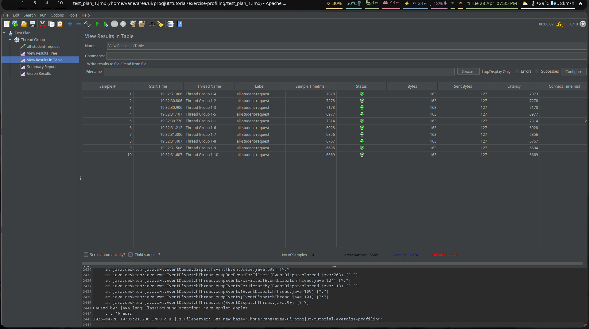
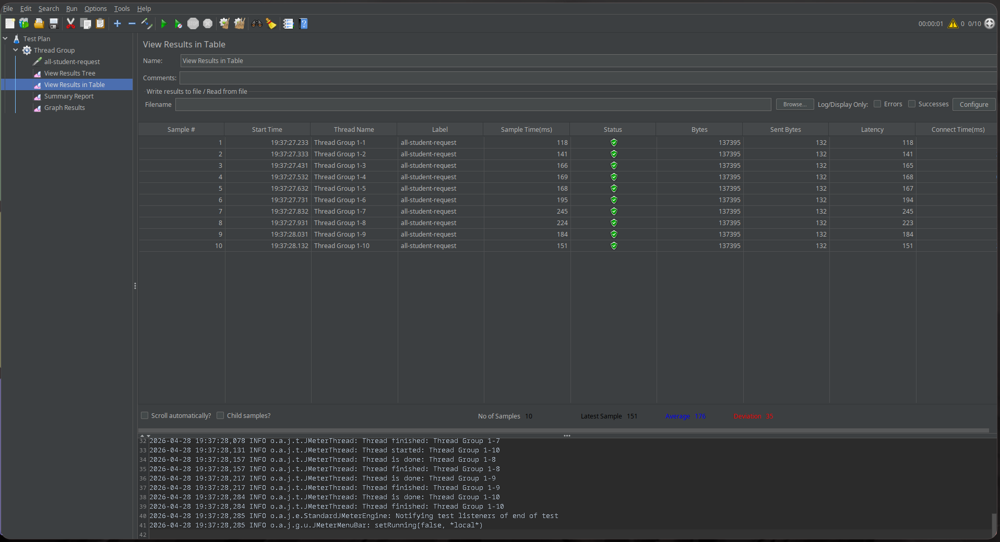
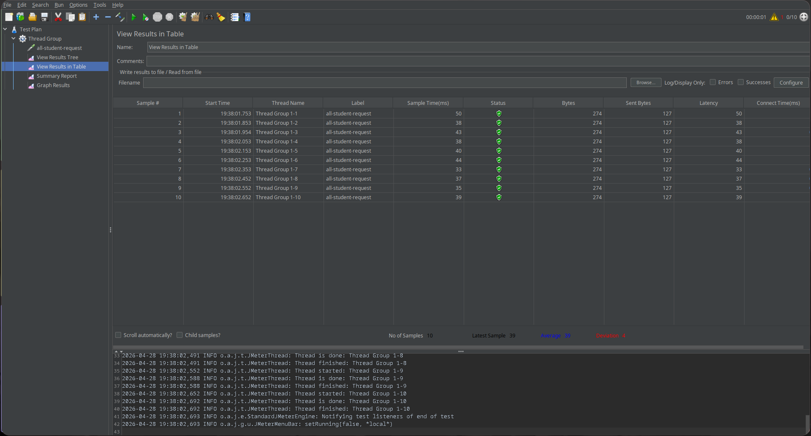
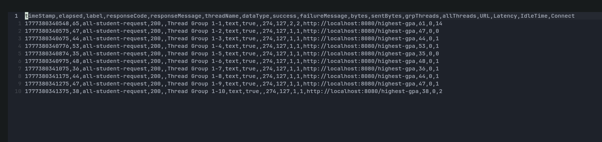
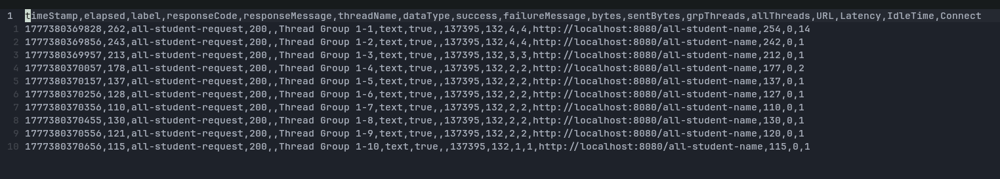
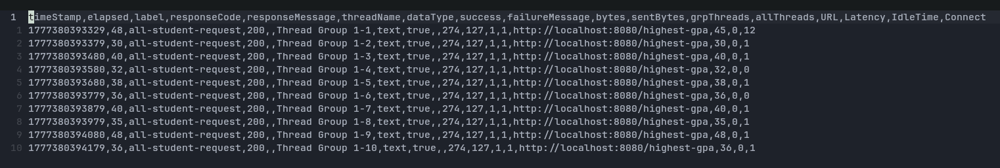
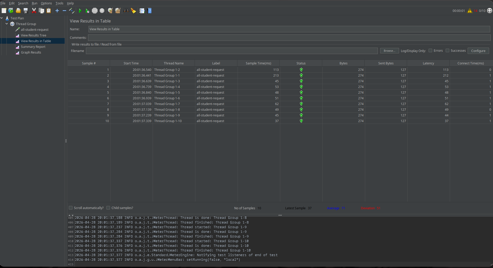

# BEFORE optimization

## GUI jmeter results

Results for /all-student

Results for /all-student-name

Results for /highest-gpa

## CLI jmeter results

Results for /all-student

Results for /all-student-name

Results for /highest-gpa

# AFTER optimization

Final GUI results for /all-student

The conclusion is most of the time bottleneck are caused by frequent calls to the database unnecessarily for many small queries (i.e. fetching courses by id). This causes the program to overutilize the CPU and underutilize the memory as the solution is to simply query all the subsequent repositories THEN perform needed calculations. 

# Reflection

1. What is the difference between the approach of performance testing with JMeter and profiling with IntelliJ Profiler in the context of optimizing application performance?

Using JMeter is commonly referred to as "black-box testing" (i.e., it tests the application from the outside, typically via network traffic). This type of performance testing indicates whether an application is overall slow or fast. Using IntelliJ Profiler is considered "white-box testing" (i.e., it tests the app from the inside by inspecting the internal execution of the code). It tells us why the application is slow and exactly where the bottleneck is in the code.

2. How does the profiling process help you in identifying and understanding the weak points in your application?
It helps by revealing exactly which method or part of the code is the least performant, eliminating the need to guess or manually test each feature.

3. Do you think IntelliJ Profiler is effective in assisting you to analyze and identify bottlenecks in your application code?
Yes. Visual aids like the flame graph help tremendously in intuitively understanding the scale of a problem (i.e., determining which part of the code to prioritize when optimizing).

4. What are the main challenges you face when conducting performance testing and profiling, and how do you overcome these challenges?
Due to Spring Boot's numerous reflection calls, navigating the logs can be difficult. It can be challenging to differentiate between framework/library code and my own code, and to pinpoint which specific parts are the main issues. To overcome this, I focus on filtering the profiling data to isolate my application's specific packages.

5. What are the main benefits you gain from using IntelliJ Profiler for profiling your application code?
It significantly improves development efficiency during optimization. It highlights the high-priority parts of the code to fix, rather than wasting time optimizing areas that will yield only negligible performance gains.

6. How do you handle situations where the results from profiling with IntelliJ Profiler are not entirely consistent with findings from performance testing using JMeter?
Identifying the discrepancies provides clues about where the issue might lie. For example, good Profiler results but poor JMeter results can imply that external factors like network latency or database locks are causing the issue (which usually requires checking if the system breaks under concurrency rather than single-thread execution).

7. What strategies do you implement in optimizing application code after analyzing results from performance testing and profiling? How do you ensure the changes you make do not affect the application's functionality?
Regression tests (using unit testing and/or integration testing) play a major role in enabling "fearless" optimization, similar to refactoring. A robust test suite ensures you will be immediately notified via test case failures if your optimizations alter the application's core functionality.
